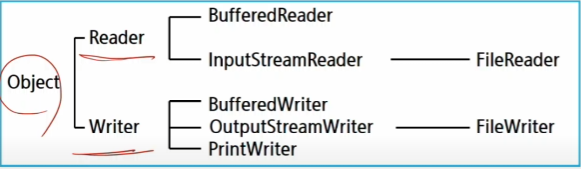
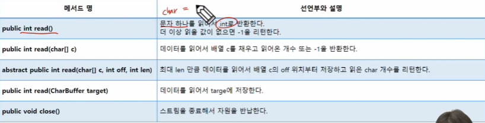
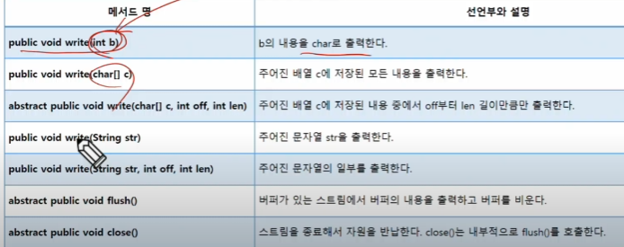
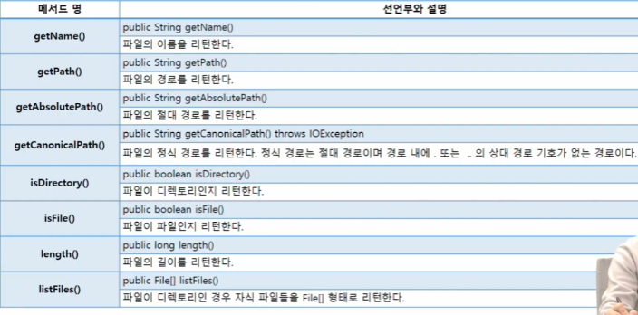
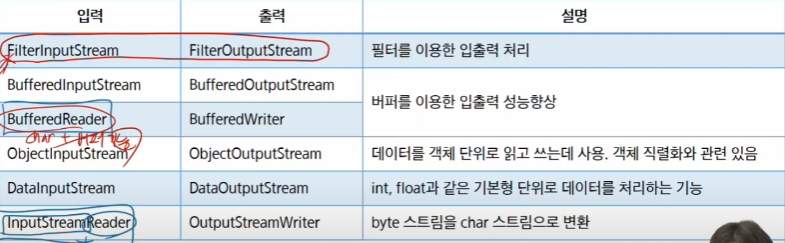
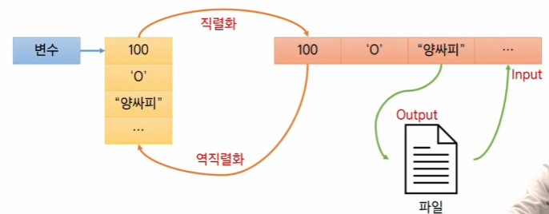

# 객체 지향 프로그래밍
## I/O와 Stream
* I/O
  * 데이터의 입력(Input)/ 출력(Output)
  * 컴퓨터 내부 혹은 외부의 장치와 데이터를 주고 받는 행위
* Stream 
  * 데이터를 운반하는데 사용되는 통로
  * 물흐름과 같이 단방향으로만 통신 가능
  * 하나의 스트림을 이용하여 입력과 출력 처리 불가능
  * 노드 스트림, 보조 스트림
* Node
  * 데이터의 출발지점, 혹은 목적지
  * ex)키보드, 모니터, 파일 등등
* 문자 스트림 (character stream)
  *  문자 단위로 입출력 


  * Reader


  * Writer
```java
public static void main(String[] args) {
		//ByteStream을 이용해서 이미지(파일)를 입출력
		FileInputStream fis = null;
		FileOutputStream fos = null;
		
		
		try {
			fis = new FileInputStream("cat.jpg");
			fos = new FileOutputStream("cat-copy2.jpg");
			
			int b; // File로부터 읽어올 데이터를 임시저장할 변수.
			// 1 바이트씩 저장, 더 이상 읽을 값이 없으면 -1
			
			while((b = fis.read())!=-1) { // 1 바이트를 읽어와서, -1이 아니라면, 
				// b에 바이트를 하나 읽어왔음.
				fos.write(b);
			}
			System.out.println("복사가 끝났습니다.");
			
		} catch (IOException e) {
			e.printStackTrace();
		} finally {
			try {
				// fis 가 null일 수도 있다.				
				if(fis!=null);
					fis.close();
				if(fos!=null);
					fos.close();
					System.out.println("스트림이 닫혔습니다.");
			} catch (IOException e) {
				// TODO Auto-generated catch block
				e.printStackTrace();
			}
		}
		// 사실은, 스트림을 닫아줘야 한다.
		
		
	}
```
```java
public static void main(String[] args) {
		//ByteStream을 이용해서 이미지(파일)를 입출력
		
		try (FileInputStream fis =  new FileInputStream("dog2.jpg");
				FileOutputStream fos = new FileOutputStream("dog2-copy.jpg");
				){ // ()안에 내가 사용할 스트림 변수를 선언 & 생성.
			// ; 로 끝나는 여러 문장 가능.
			
			// buffer를 사용하면 반환되는 b의 의미가 바뀐다.
			int b; // 읽어온(Stream이 채워준 바이트) 개수(못 읽었다면 -1)
			byte[] buffer = new byte[10];
			
			while((b = fis.read(buffer))!=-1) { // 1 바이트를 읽어와서, -1이 아니라면, 
				// b에 바이트를 하나 읽어왔음.
				fos.write(buffer, 0, b);
			}
			System.out.println("복사가 끝났습니다.");
			System.out.println("스트림은 알아서 닫힙니다.");
			
		} catch (IOException e) {
			e.printStackTrace();
		}
		// 사실은, 스트림을 닫아줘야 한다.
	}
```

* File(클래스)
  * 가장 기본적인 입출력 장치 중 하나로 파일과 디렉터리를 다루는 클래스
  * 특정 파일에 대한 정보를 객체화해서 관리하겠다.


```java
public static void main(String[] args) {
		// File 클래스 : 파일 또는 폴더를 관리하기 위한 클래스
		
		File f = new File("big_input.txt"); // 상대 경로
		// 실행 지점을 기준.
		
		System.out.println(f.getName());
		System.out.println(f.getAbsolutePath()); // 파일에 대한 경로를 객체화 해서 가지고 있음. 절대 경로
		System.out.println(f.isDirectory());
		System.out.println(f.isFile());
		
		File folder =  new File("folder");
		folder.mkdir(); // 상대 경로에 폴더가 만들어짐
		System.out.println(folder.isDirectory());
	}
```
## 보조 스트림
* 보조 스트림
  * 스트림의 기능을 보완하기 위해 사용
  * 실제 데이터를 주고 받는 스트림이 아니므로 보조 스트림만으로 입출력 불가
  * 스트림 생성 후 보조 스트림 생성하여 사용가능
  * 여러 보조 스트림을 연결하여 사용 가능


```java
public class Test01 {
	public static void main(String[] args) throws IOException {
		// BufferedReader & BufferedWriter가 더빠른지?

		// FileReader & FileWriter
		test1("    FileReader & FileWriter    ");

		// BufferedReader & BufferedWriter
		test2("BufferedReader & BufferedWriter");
	}

	public static void test1(String testname) throws IOException {
		try (FileReader reader = new FileReader("big_input.txt");
				FileWriter writer = new FileWriter("big_input-copy2.txt")) {
			long start = System.nanoTime();
			int c;
			while ((c = reader.read()) != -1) {
				writer.write(c);
			}
			long end = System.nanoTime();
			System.out.printf("%s - %15d ns. \n", testname, end - start);
		}
	}

	// 보조스트림 사용하기
	public static void test2(String testname) throws IOException {
		try (BufferedReader reader = new BufferedReader(new FileReader("big_input.txt"));
				BufferedWriter writer = new BufferedWriter(new FileWriter("big_input-copy3.txt"))) {
			long start = System.nanoTime();
			// buffered reader & writer는 character 하나씩 읽어오는 게 아님!
			String line; // line 단위
			while ((line = reader.readLine()) != null) {
				writer.write(line);
				writer.newLine();
			}
			long end = System.nanoTime();
			System.out.printf("%s - %15d ns. \n", testname, end - start);
		}
	}
```
```java
	public static void main(String[] args) throws IOException {
		// Scanner vs. BufferedReader
		// - big_input.txt에서 한줄씩 읽어와서
		// - 정수형으로 바꾸기
		
		

		// Scanner
		// - 형변환을 알아서 해줌
		// - nextInt();
		test1("    Scanner   ");

		// BufferedReader
		// - Integer.parseInt(문자열) : 직접해야함.
		test2("BufferedReader");
	}

	public static void test1(String testname) throws IOException {
		try (Scanner sc = new Scanner(new FileInputStream("big_input.txt"))) {
			long start = System.nanoTime();
			while (sc.hasNext()) {
				int num = sc.nextInt();
			}
			long end = System.nanoTime();
			System.out.printf("%s - %15d ns. \n", testname, end - start);
		}
	}

	public static void test2(String testname) throws IOException {
		try (BufferedReader br = new BufferedReader(new InputStreamReader(new FileInputStream("big_input.txt")))) {
			// 표준입출력 -> 알고리즘 ->
			// System.in <= InputStream
			// System.out <= OutputStream
			// ex) 키보드에서 입력 받을 때
			// BufferedReader in = new BufferedReader(new InputStreamReader(System.in));
			// cf)
			// Scanner sc = new Scanner(System.in));
			// BufferdInputStream in = new BufferdInputStream(new FileInputStream());
			long start = System.nanoTime();

			String l;
			while ((l = br.readLine()) != null) {
				int num = Integer.parseInt(l);
			}

			long end = System.nanoTime();
			System.out.printf("%s - %15d ns. \n", testname, end - start);
		}
	}
```


## 객체 직렬화
* 직렬화(serialization)
  * 객체가 가진 데이터를 순차적인 형태로 변환하는 절차
  * 객체를 데이터 스트림으로 만드는 것
  * 반대의 경우 역직렬화(deserialization)



* 직렬화 가능 클래스 만들기
  * Serializable 인터페이스 구현(내용은x)
  * 해당 인터페이스를 구현한 클래스를 상속받았다면 구현하지 않아도 된다.
  * 자손에만 구현했다면 조상클래스는 직렬화 되지 않는다
  * transient 키워드를 통해 직렬화 대상에서 제외 가능 (저장하지 않겠다는 뜻)
* serialVersionUID
  * 직렬화 된 객체를 역직렬화 할 때는 직렬화 했을 때와 같은 클래스를 사용해야 한다.
  * 따라서 해당 UID를 활용하여 클래스의 변경 여부를 파악한다.
  * 작성하지 않으면 컴파일러가 자동으로 생성(멤버 변경시 자동 수정 -> 위험)
  * 따라서 작성하는 것을 권장
```java
public static void main(String[] args) {
		List<Student> list = new ArrayList<>();
		
		list.add(new Student("손영준", "서울7반"));
		list.add(new Student("김윤홍", "서울5반"));
		
		try(ObjectOutputStream oos = new ObjectOutputStream(new FileOutputStream("list.dat"))){
			oos.writeObject(list);
		} catch (IOException e) {
			// TODO Auto-generated catch block
			e.printStackTrace();
		}
	}
}
```
```java
public static void main(String[] args) {
		
		try(ObjectInputStream ois = new ObjectInputStream(new FileInputStream("list.dat"))){
			Object obj = ois.readObject();
			
			List<Student> list = (List<Student>) obj;
			System.out.println(list);
		}  catch (IOException | ClassNotFoundException e) {
			// TODO Auto-generated catch block
			e.printStackTrace();
		}
		
	}
```