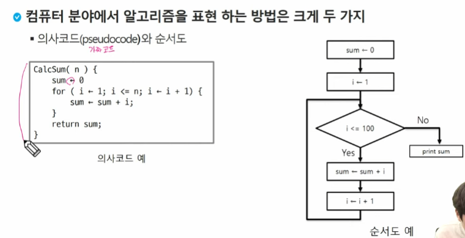
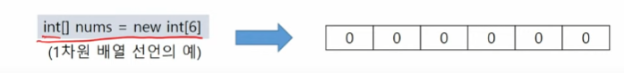

# Array
## 알고리즘 APS
* 알고리즘: 문제를 해결하기 위해 수행해야 하는 절차나 방법
  * 컴퓨터 분야에서의 알고리즘 : 원하는 결과를 얻기 위해 프로그램이 수행해야 하는 절차
* APS (Algorithm Problem Solving)
  * 알고리즘 문제: 주어진 문제에 따라 원하는 결과를 낼 수 있도록 프로그램을 작성하는 문제
  * 프로그래밍 역량을 테스트하기 위한 문제 풀이 
* <u>공부하는 이유</u>
  * 구현력을 키울 수 있다.
  * 디버깅 경험을 쌓을 수 있다.
  * 논리적으로 생각하는 능력이 생긴다.
#
* APS 과정의 목표: 다양한 알고리즘을 이해하고, 문제의 조건에 맞는 좋은 알고리즘을 선택할 수 있게 되는 것
* 무엇이 좋은 알고리즘인가?
  1. 정확성: 얼마나  정확하게 동작하는가
  2. 작업량: 얼마나 적은 연산으로 원하는 결과를 얻어내는가
  3. 메모리 작업량: 얼마나 적은 메모리를 사용하는가
  4. 단순성: 얼마나 단순한가
  5. 최적성: 더 이상 개선할 여지 없이 최적화되었는가
# 
* 컴퓨터 분야에서 알고리즘을 표현하는 방법은 크게 구가지


* 주어진 문제를 해결하기 위해 여러 개의 다양한 알고리즘이 가능
  * 어떤 알고리즘을 사용해야 하는가?
* 알고리즘의 성능 분석 필요
  * 많은 문제에서 성능 분석의 기준으로 알고리즘의 작업량을 비교한다
#
* 알고리즘의 작업량을 표현할 때 시간복잡도로 표현한다.
* 시간 복잡도(Time Complexity)
  * 실제 걸리는 시간을 측정
  * 실행되는 명령문의 개수를 계산

## 배열 (배열 활용 예제: Gravity)
- 동일한 자료형 데이터를 여러개 담을 수 있는 자료구조
### 자료구조
* 자료구조: 데이터를 효율적으로 담는 방법을 정의한 것
  * 데이터의 추가, 조회, 수정, 삭제 연산을 최적화 하는 구조
* 프로그램의 목적에 따라 활용할 수 있는 다양한 자료구조가 존재한다.
  * ex)Array, List, Stack, Queue, Tree...\
* 효율적인 알고리즘을 구현하기 위해서는 효율적인 자료구조가 필수적
* 배열이란 무엇인가?
  * 동일한 자료형의 변수들을 하나의 변수에 담기 위한 자료구조
* 배열의 필요성 
  * 프로그램 내에서 여러 개의 데이터를 다뤄야 할 때, 별도의 변수를 선언하여 프로그래밍하는 것은 비효율적
  * 배열을 사용하면 한 번의 선언을 통해서 여러 개의 데이터를 다룰 수 있다

### 1차원 배열
* 1차원 배열의 선언
  * 자료형 : 배열을 이루는 자료형
  * 이름 : 프로그램에서 사용할 배열의 이름
  * 길이 : 배열을 이루는 원소의 수


* 1차원 배열의 순회 
  * 배열의 요소를 빠짐 없이 조사하는 방법
```java
import java.util.Arrays;

public class Array_01_배열순회 {
	public static void main(String[] args) {
		
//		// 1. 배열 선언 후 할당
//		int[] nums = new int[6];
//		
//		System.out.println(Arrays.toString(nums));
//		
//		nums[0] = 1;
//		nums[1] = 2;
//		nums[2] = 3;
//		nums[3] = 4;
//		nums[4] = 5;
//		nums[5] = 6;
//		
//		System.out.println(Arrays.toString(nums));
		
		// 2. 배열 선언과 동시에 초기화
		int[] arr = {1,2,3,4,5,6,32};
//		System.out.println(Arrays.toString(arr));
		
		// 3. 정방향 순회
		// 인데스 0에서 부터 끝까지 가는 것 기억하지!
		for(int i = 0; i<arr.length; i++) {
			System.out.println(arr[i]);
		}
		
		
		// 4. 역방향 순회
		// 인덱스가 큰 값에서 작은 값으로 이동하는 것을 기억하기!
		for(int i = arr.length -1; i>=0; i--) {
			System.out.println(arr[i]);
		}
		
		// 5. 3번 인덱스를 기준으로 양 옆으로 퍼져나가는 순회
		// 중앙 인덱스를 중심으로 오른쪽 왼쪽으로 나눠서 적용!
		for (int i = 3; i<arr.length; i++) {
			System.out.println(arr[i]);
		}
		for(int i=2; i>=0;i--) {
			System.out.println(arr[i]);
		}
	}
}
```
## APS 위한 5단계
1. 문제를 꼼꼼하게 읽고 입력 데이터의 범위를 확인한다.
2. 문제의 조건과 입력 데이터의 범위에 맞는 알고리즘을 선택한다.
3. 코드를 작성하기 전에 풀이를 구상한다.(종이와 팬으로!)
4. 구상한 풀이를 코드로 작성한다.
5. 디버깅하고 검증한다.
## 정렬
* 2개 이상의 데이터를 특정 기준에 의해 작은 값부터 근 값(오름차순:ascending), 혹은 그 반대의 순서대로(내림차순:descending) 재배열하는 것
* 키
  * 자료를 정렬하는 기준이 되는 특정 값
### 정렬의 종류
* 대표적인 정렬 방식의 종류
  * 버블 정렬
  * 선택 정렬
  * 삽입 정렬
  * 카운팅 정렬
  * 병합 정렬
  * 퀵 정렬
* APS 과정을 통해 자료구조와 알고리즘을 학습하면서 다양한 형태의 정렬을 학습하게 된다.

## 버블 정렬(Bubble Sort)
* 인접한 두 개의 원소를 비교한 후 교환하는 과정을 반복하여 데이터를 정렬하는 방싟
* 정렬과정
  * 첫 번째 원소부터 인접한 원소와 비교하여 자리를 교환해가면서 마지막 자리까지 이동한다.
  * (오름차순 정렬 기준)한 사이클이 끝나면 가장 큰 원소가 마지막 자리로 위치한다.
  * 교화하며 자리를 이동하는 모습이 물 위에 올라오는 거품 모양과 같다고 하여 버블 정렬이라고 한다.
* 시간복잡도 
  * O(n*n)
```java
import java.util.Arrays;

public class Array_02_버블정렬 {
	public static void main(String[] args) {
		int[] arr = {32,17,83,54,49,22};
		
		
		//모든 사이클
		for (int j = 0; j < arr.length - 1; j++) {
			
		
		// 하나의 사이클
		for(int i = 0; i<arr.length-1; i++) {
			if(arr[i]<arr[i + 1]) {
				// 자리 바꾸기(swap)
				int tmp = arr[i];
				arr[i] = arr[i+1];
				arr[i+1] = tmp;
				// 그냥 두개의 수를 바꾸면 복사가 되는 바람에 성사가 되지 않는다
				// 그렇기 때문에 잠깐 저장해둘 변수 한개 추가 tmp.
			}
		}
		
	}System.out.println(Arrays.toString(arr));
}
}
```