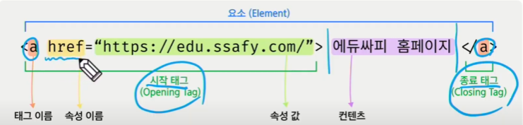
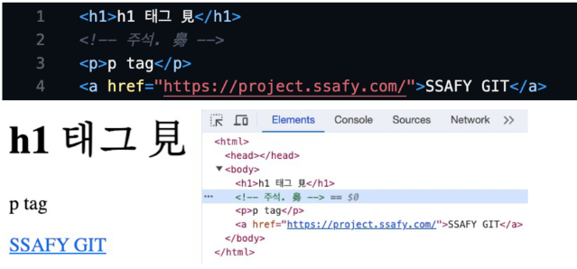
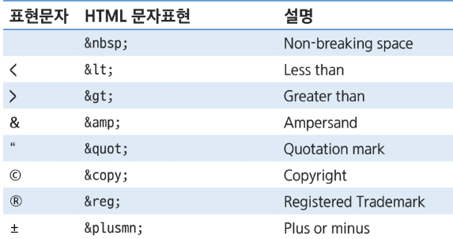
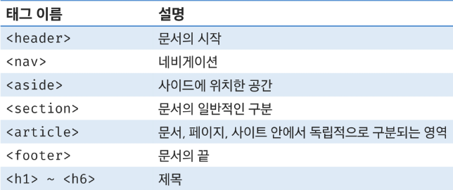
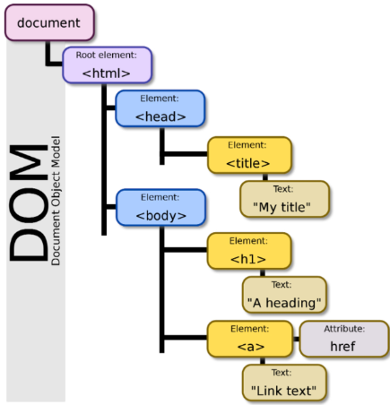
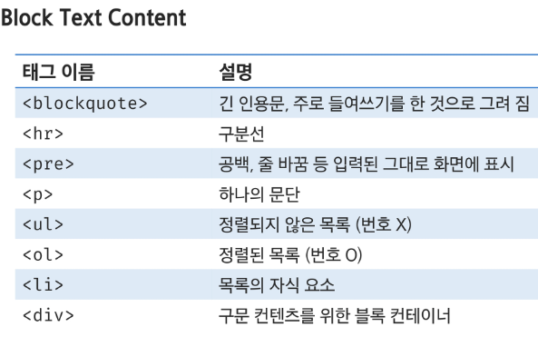
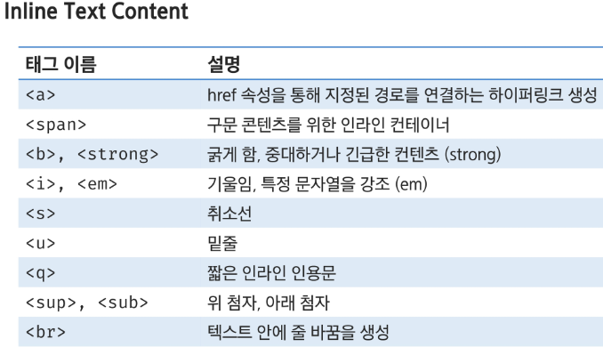
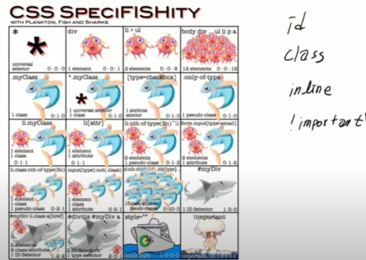

# HTML & CSS
## Web 소개
* HTML - 구조
* CSS - 꾸밈, 스타일링
* JS - 동작

## 웹과 브라우저
* 웹 사이트는 브라우저를 통해 동작
* 브라우저마다 동작이 조금씩 달라서 실행에 문제가 생기는 경우 있음
* 이러한 문제를 해결하기 위해서 웹 표준이 있음

## 웹 표준
* 웹에서 사용되는 표준 기술이나 규칙
* 브라우저 종류에 관계없이 동일하게 보이도록 가이드 제공

## 크롬 개발자 도구 - Chrome Developer Tools
* 개발과 관련된 다양한 기능
* 크롬 브라우저 우측 상단 > 도구 더보기 (More Tools) > 개발자 도구 (Developer Tools)
* Elements, Sources, Nestwork, Performance, Application 등을 활용
* ctrl + shift + i

## HTML
* Hyper Text Markup Language
* Hyper Text : 참조를 통해 한 문서에서 다른 문서로 즉시 접근할 수 있는 텍스트
* Markup : 태그(Tag) 등을 이용하여 문서나 데이터의 구조를 정의하는 언어
* Markdown : Markup 언어의 일종으로 기호를 활용한 읽기와 쓰기 간단한 언어 .md 확장자 파일

* 웹페이지를 작성하기 위한 언어
* .html 확장자를 가짐
* 태그(Tag) 는 대소문자 구분이 없음
* Enter, Space Bar, Tab 적용되지 않음
* 마크업 스타일
    * 1 Indent == 2 Space Bar

## 기본 구조 
* ```<!DOCTYPE>``` 
  * HTML 문서가 따라야할 일종의 오랜 약속이나 작성하지 않아도 잘 작동함
* ```<html></html>```
  * HTML 최상위 요소로 페이지 전체의 컨텐츠를 감싸는 루트 요소
  * 문서내에서 사용할 문자코드를 lang(어떤 언어로 사용할건지 지정) 속성에 지정
* ```<head></head>```
  * HTML 문서에 표현하고 싶은 구성 요소 외의 재료들을 담고 있는 공안
  * 페이지 이름, CSS, favicon 등을 작성
  * 브라우저 화면에 출력되지 않음
* ```<meta>```
  * 문서의 작성자, 날짜 등 화면에 출력되지 않는 일반 정보들
  * charset = "utf - 8" : HTML 문서가 사용할 문서 형태 지정
  * name = "viewport" content-width = "device-width" : HTML 문서에 너비를 보장해주어 흘러 넘치지 않게 함
* ```<title></title>```
  * HTML 문서의 제목으로 브라우저 탭에 표시 됨
* ```<body></body>```
  * 브라우저 화면에 나타나는 정보로 HTML문서에 보여줄 모든 요소를 작성하는 공간
  * id 속성을 이용해서 문서 내에서 tag 식별 가능(중복x)
  * class 속성을 이용하여 여러 tag에 공통적인 특성 부여 (중복o)

## 요소와 태그 
* HTML의 요소(Element)는 태그(Tag)와 내용으로 구성

* 시작 태그 / 종료태그로 쌍을 이루거나 시작태그만 존재하는 경우도 있음
* 각각의 시작태그는 속성을 가질 수 있음

* 요소 중첩
  * ```<p> You can call me<string>Taek</strong>.</p>```
  * 닫는 태그의 생략 - 빈 요소

## 주석
* 주석의 내용은 브라우저에 출력되지 않음
* HTML Tag의 태용을 설명하기 위한 용도로 사용
* ```<!-- HTML 주석 내용 -->```

  

## 특수 문자


## Sematic Tag
* 의미론적 요소를 담은 태그
  


* 브라우저에 표시되는 정보를 태그로 표현
* 단순히 구역을 나누는 것뿐만 아니라, 구조를 나누는 데에 의미가 필요
* 요소의 의미가 확실하기 때문에 코드의 가독성 뿐만 아니라 유지보수 용이

## DOM 트리 
* HTML문서를 브라우저에 렌더링 하기 위한 구조
* 조상 관계 - ancestor
* 자손 관계 - descendant
* 부모 관계 - parent children
* 형제 관계 - sibling


## Block Text Content



```html
<!-- blockquote -->
  <h2>blockquote</h2>
  <li>긴 인용문 주요 들여쓰기를 한 것으로 그려짐</li>
  <!-- 코드를 작성하세요. -->
  <blockquote>이것은 블록쿼트입니다</blockquote>


  <!-- hr -->
  <h2>hr</h2>
  <li>구분선</li> 
  <!-- 코드를 작성하세요. -->
  <hr />


  <!-- pre -->
  <h2>pre</h2>
  <li>공백, 줄바꿈 등 입력된 그대로 화면에 표시 줄바꿈, 탭 그대로 보여요
  </li>
  <!-- 코드를 작성하세요. -->
  <pre>
    안녕하세요 
    저는 오지혜입니다.
  </pre>


  <!-- p -->
  <h2>p</h2>
  <li>하나의 문단</li>
  <!-- 코드를 작성하세요. -->
  <p>안녕하세요!</p>


  <!-- ul, li -->
  <h2>ul</h2>
  <li>순서가 없는 리스트, Unordered List</li>
  <!-- 코드를 작성하세요. -->
  <ul>
    <li>순서가 없는 리스트입니다</li>
  </ul>


  <!-- ol, li -->
  <li>순서가 있는 리스트, Ordered List</li>
  <!-- 코드를 작성하세요. -->
  <ol type="1" start="a">
    <li>순서가 있는 리스트</li>
    <li>순서가 있는 리스트</li>
    <li>순서가 있는 리스트</li>
    <li>순서가 있는 리스트</li>
  </ol>
  <!-- type과 start 속성을 활용해서 코드를 작성해보세요. -->
  


  <!-- div -->
  <h2>div</h2>
  <li>구문 컨텐츠를 위한 블록 컨테이너</li>
  <!-- 코드를 작성하세요. -->
  <div>안녕하세요!!</div>
```

## Inline Text Content



```html
<!-- a -->
  <h2>a</h2>
  <li>a, href 속성을 통해 하이퍼링크로 사용하는 것임을 기억하기</li>
  <!-- 코드를 작성하세요. -->
  <a href="https://www.naver.com">naver</a>
  


  <!-- span -->
  <h2>span</h2>
  <li>일반 텍스트고 인라인 요소라면 span 태그를 쓰자</li>
  <!-- 코드를 작성하세요. -->
  <span>저는 김윤홍입니다</span>
  <span>저는 땡땡땡입니다</span>


  <!-- b, strong -->
  <h2>b, strong</h2>
  <li>굵은 글씨, </li>
  <li>중요하거나 급한 컨텐츠이면 <strong>strong</strong></li>
  <!-- 코드를 작성하세요. -->


  <!-- i, em -->
  <h2>i, em</h2>
  <li>기울임, </li>
  <li>특정 문자열 <em>강조</em></li>
  <!-- 코드를 작성하세요. -->


  <!-- s -->
  <h2>s</h2>
  <li>취소선</li>
  <!-- 코드를 작성하세요. -->


  <!-- u -->
  <h2>u</h2>
  <li>밑줄</li>
  <!-- 코드를 작성하세요. -->


  <!-- sup, sub -->
  <h2>sup, sub</h2>
  <li>sup 윗첨자</li>
  <!-- 코드를 작성하세요. -->
  <span>안녕하세요<sup>저는 김윤홍입니다.</sup></span>
  

  <li>sub 아래첨자</li>
  <!-- 코드를 작성하세요. -->
  
  
  
  <!-- br -->
  <h2>br</h2>
  <li>강제 줄바꿈, 비추</li>
  <!-- 코드를 작성하세요. -->
```

## form
## input

# CSS
* Cascading Style Sheets
* HTML 문서를 화면에 표시하는 방식을 정의한 언어
* 웹 문서의 내용과 관계없이 디자인만 바꿀 수 있음
* 다양한 기기에 맞게 반응형으로 바뀌는 문서를 만들 수 있음

## 기본 구조
```css
.box{ 
    backgrond-color: red;
    width: 10rem;
    height: 2rem;
    border: black 1rem dotted;
}
```
## 주석
* 주석의 내용은 style 탭에 표시되지 않음
  * source나 element 탭에서는 확인 가능

* /* CSS주석 내용 */

## CSS 적용 방법
* External Style Sheet - 외부 스타일 시트
  * 외부에 작성된 css 파일을 불러와서 스타일을 적용시키는 방식
  * ```<head>``` 안에 ```<link>``` 를 사용하여 외부 스타일 시트 적용
  * href 속성에 css파일의 경로 작성(rel 속성값은 stylesheet)
* Internal Style Sheet - 내부 스타일 시트
  * HTML 파일 내에 스타일을 적용하는 방식
  * ```<head>``` 안에 ```<style>``` 사용
    * CSS 파일에 작성하는 내용과 동일하게 작성
  * 외부 스타일 시트보다 우선 적용
* Inline Style - 인라인 스타일 
  * 요소의 태그에서 style 속성을 사용하여 속성값으로 스타일을 적용시키는 방식

## CSS 선택자
* HTML 문서에서 CSS 규칙을 적용할 요소를 정의
* 기본 선택자 
  * 전체 선택자(General Selector) - *
  * 유형 선택자(Type Selector) - 요소
  * 아이디 선택자(ID Selector) - id
  * 클래스 선택자(Class Selector) - class
  * 특성 선택자(Attribute Selector)
* 그룹 선택자
* 결합자
  * 자손 결합자(Descendent Combonator) - 공백, 자식 결합자(Child Comboinator) -> 
  * 일반 형제 결합자(Subsequent-sibling Combinator) - ~, 인접 형제 결합자(Adjacent-sibling Combinator) - +
* 의사 클래스 / 요소
  * 링크, 동적 의사 클래스 (Pseudo Class)
  * 구조적/기타 의사 클래스, 의사 엘리먼트, 속성 선택자
* 우선순위, 상속

## 전체 선택자(Universal Selector)
* HTML 문서 내 모든 요소(Element)를 선택
* 사용법 ```*{style properties}```
```css
<style>
    * {
      color: blue;
    }
  </style>
```

## 유형 선택자(Type Selector)
* 요소의 이름 - 태그(Tag)을 이용하여 스타일을 적용
* HTMl 내에서 주어진 유형의 모든 요소를 선택
* 사용법 ```element{style properties}```
```css
<style>
    h2 {
      color: blue;
    }
  </style>
```

## 아이디 선택자(ID Selector)
* ID 특성 값을 비교하여, 동일한 ID를 가지 태그(Tag)를 선택
* HTML 내에서 주어진 ID를 가진 요소가 하나만 존재 해야함
* 사용법 ```#id-name{style properties}```

```css
<style>
    #seoul { 
      color: blue; 
    }
    #seoul { 
      color: green; 
    }
  </style>
```

## 클래스 선택자(Class Selector)
* Class가 적용된 모든 태그 (Tag)를 선택
* HTML 내에서 동일한 클래스 명을 중복해서 사용 가능
* 사용법 ```.class-name{style properties}```

```css
<style>
    .ssafy { 
      {color: pink;} 
    }
  </style>
```

## 특성 선택자(Attribute Selector)
* 태그(Tag)/아이디(ID)/클래스(Class)와 속성명과 속성값을 활용하여 요소를 선택
* HTML 내부에서 동일한 특성을 가진 요소는 모두 선택
* 사용법 ```element|id-name|class-name[property=value] {style properties}
```css
input[name = "ssafy"] { 
      color: magenta; 
    }
     input[class = "button"], input[name = "ssafy"]{ 
      color: green; 
    }
```

## 선택자 목록(Selector List)
* ,를 이용하여 선택자 그룹을 생성하는 방법
* 일치하는 모든 노드를 선택
* 사용법 ```element, element ...{style properties}```
```css
<style>
     h2, .one, .two { 
      color: skyblue; 
    }
  </style>
```

## 자손 결합자()
* 첫 번째 요소의 자손인 노드를 선택
* 공백(Space Bar)를 사용
* 사용법
  * ```selector1 selector2{style properties}```
  
## 자식 결합자(Child Combinator)
* 첫 번째 요소의 바로 아래 자식인 노드를 선택
*  '>'를 사용
*  사용법 
   *  ```selector1 > selector2{style properties}```
  
## 일반 형제 결합자(Subsequent Sibling Combinator)
* 첫 번째 요소를 뒤따르면서 같은 부모를 공유하는 두 번째 요소를 모두 선택
* '~'를 사용
* 사용법 
  * ```former-element ~ target-element{style properties}```

## 인접 형제 결합자(Adjacent Sibling Combinator)
* 첫 번째 요소의 바로 뒤에 위치하면서 같은 부모를 공유하는 두번째 요소 선택
* '+'를 사용
* 사용법
  * ```former-element + target-element{style properties}```
  
## 우선 순위



