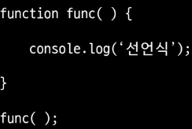
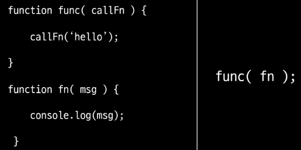

# JavaScript
* 자바스크립트란?
    * 프로토타입 기반 객체 생성을 지원하는 동적 스크립트 언어
    * 웹 브라우저에서 주로 사용, Node.js를 이용하여 콘솔 환경에서 사용
    * 웹 브라우저의 UI를 제어하기 위해 만들어진 프로그래밍 언어
    * 자바와 기본 구문이 비슷하다.(C언어의 기본 구문을 바탕)
## 기본 문법
* HTML 자바스크립트 사용
    * ```<script></script>``` 태그를 사용
    * 문서 내의 위치의 제약이 없다

    
* 외부스크립트 참조하기
    * .js 확장자를 가진 파일을 생성
    * html 문서에서 ```<script src="외부파일의 위치"></script>```

    

* 주석(comment)
    * // 한줄 주석
    * /* */ 여러 줄 주석

* 변수(Variable)
    * 자바스크립트의 변수 타입은 가리키는 값에 대한 타입을 나타냄
    * var, let, const 키워드를 이용해서 변수를 선언
    * var를 이용한 변수의 선언일 경우 중복 선언이 가능
    * undefined 는 변수에 아무 값도 없어서 타입을 알수 없는 경우를 말함
    * 동적 타입: 대입되는 값에 따라서 용도가 변경되는 방식
    * 문서, $, _로 시작, 대소문자 구분, 예약어 사용 X

* var
    * 재 선언 가능, 재 할당 가능
    * ES6 이전에 변수 선언 시 사용
    * 호이스팅 (Hoisting) 특성이 있음
    * 함수 스코프

    

* let
    * 재 선언 불가, 재 할당 가능
    * 블록 스코프

    

* const
    * 재 선언 불가, 재 할당 불가
    * 블록 스코프
    * 대문자 SNAKE_CASE 사용
    * 선언 시 값을 할당해야함
    * 상수로 사용

    

* undefined
    * 변수에 값이 대입되지 않은 상태

    

* 데이터 타입 (Data type)
    * 기본 데이터 타입(Primitive Type)
        * String, Number, Boolean, null, undefined
    * 객체 타입(Reference Type)
        * Object - function, array 등

    

* type of - 변수의 자료형 검사
    * typeof 데이터
    * typeof(데이터)
    * typeof의 결과는 문자열 반환

    * null 의 데이터 타입은 null이 아닌 object (설계 실수)
    * function 은 기능을 가진 객체

    

* 동적 데이터 타입 - 다양한 값의 대입이 가능

    

* 숫자형(Number)
    * 정수와 실수로 나누어 구분하지 않음(부동소수점 형식)
    * 일반적인 숫자 외 특수 숫자 포함(Infinity, NaN...)
    * e를 활용하여 거듭제곱 표현 가능

* 문자열 (String)
    * " ", ' ' 로 감싼다
    * ` `(backtick)으로 감싸면 여러줄 입력이 가능 - 공백, 줄 넘김 유지

    

* 문자열(String) 연산
    * 문자열과 숫자 타입의 + 연산 -> 문자열
    * 문자열과 숫자 타입의 + 연산 이외 -> 숫자

    

* 자바스크립트 false
    * 아래의 5가지 값은 false로 인식, 나머지 값은 true로 인식
    * null
    * undiefined
    * 0
    * '' (빈문자열)
    * NaN

    

* 연산자(Operator)
    * 자바와 같음

* 일치 연산자
    * 값과 타입이 일치하는지 체크 
    * ===, !==

* 제어문(Java 유사)
    * 조건문
        * if
        * switch
    * 반복문
        * for, while, do-while

* 배열 (Array)
    * 배열의 생성: [] 또는 Array() 활용
    * 배열의 크기는 동적으로 변경된다
    * 크기가 지정되어 있지 않은 경우에도 데이터의 입력이 가능
    * 배열은 여러가지의 데이터 타입을 하나의 배열에 입력할 수 있음
    * push 함수를 이용하여 데이터 추가 가능

    

## 객체
* 객체(Object)
    * 객체는 문자열로 이름을 붙인 값들의 집합체 (Key : Value)
    * 객체에 저장하는 값을 프로퍼티(Property)라고 함
    * 객체는 prototype이라는 특별한 프로퍼티를 가지고 있음

* 객체(Object) 만들기
    * 객체 리터럴 이용 : {}
    * Object 생성자 이용 : new Object()
    * 생성자 함수 이용

    

* 객체 (Object) 생성 시 프로퍼티 추가

    

* 객체 (Object) 프로퍼티
    * .(dot) 또는 []를 이용하여 프로퍼티의 조회 및 변경을 처리

    

* 객체 (Object)프로퍼티 - 추가/수정/삭제

    

* 객체 변수에는 주소가 저장되어 공유 가능

    

* 함수안에서의 this는 함수를 호출한 객체

    

## 함수

* 함수 특징
    * 자바스크립트에서 함수는 객체 타입으로 값처럼 사용이 가능
    * 함수를 변수에 대입하거나 매개변수로 넘길 수 있음
    * 배열의 요소에 넣거나 객체의 프로퍼티로 설정이 가능
    * 매개변수의 개수가 일치하지 않아도 호출이 가능
    *  JavaScript의 함수는 일급 객체(First-class citizen)에 해당
        * 변수에 할당 가능
        * 함수의 매개변수로 전달 가능
        * 함수의 반환 값으로 사용 가능

* 함수 만들기
    * 함수 선언식

    

    * 함수 표현식

    

* 함수 선언식(function declaration)
    * 함수의 이름과 함께 정의하는 방식
    * 함수의 이름
    * 매개 변수
    * 내용
    * 호이스팅 됨

    

* 함수 표현식(function expression)
    * 익명 함수로 정의가능
    * 매개 변수
    * 내용

* 선언식 vs 표현식
    * 선언식 함수는 호이스팅의 영향을 받아 함수 선언 이전에 호출이 가능
    * 표현식 함수는 선언 이전에 호출이 가능

    

* 함수의 리턴
    * 함수의 실행 결과로 함수를 반환할 수 있음
    * 함수가 특벽한 값을 리턴하지 않은 경우 undefined가 반환됨 

    

* 함수의 호출
    * 정의된 함수를 호출 시 함수를 값으로 넘길 수 있음

    

* 함수 매개 변수 
    * 함수는 호출 시 매개변수의 영향을 받지 않음
    * arguments라는 함수 내부의 프로퍼티를 이용하여 매개변수의 처리가 가능
    * 자바스크립의 함수는 오버로딩 개념을 지원하지 않음
    * 기본 인자 (default arguments)를 사용할 수 있음