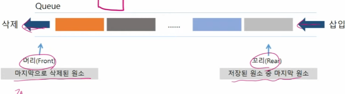
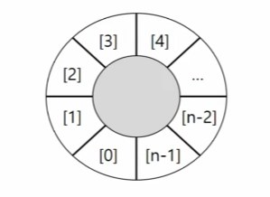

# 큐
## 큐(Queue)의 특성
  * 스택과 마찬가지로 삽입과 삭제의 위치가 제한적인 자료구조
    * 큐의 뒤에서는 삽입만 하고, 큐의 앞에서는 삭제만 이루어지는 구조
  * 선입선출구조(FIFO: First In First Out)
    * 큐에 삽입한 순서대로 원소가 저장되어, 가장 먼저 삽입(First In)된 원소는 가장 먼저 삭제(First Out) 된다.

<u>쉽게 말해 선착순으로 관리 되는 자료구조형이다</u>

## 큐의 구조 및 기본연산
  * 큐의 선입선출 구조



  * 큐의 기본연산
    * 삽입 : enQueue
    * 삭제 : deQueue

## 큐의 주요 연산

## 큐의 연산 과정
1) 공백 큐 생성 : createQueue();
* front : 데이터가 마지막으로 삭제된 위치
* rear : 데이터가 마지막으로 들어간 위치
2) 원소 A 삽입 : enQueue(A);
3) 원소 B 삽입 : enQueue(B);
4) 원소 반환/삭제 : deQueue();

## 큐의 구현
  * 선형큐
    * 1차우너 배열을 이용한 큐
      * 큐의 크기 = 배열의 크기 
      * front : 마지막으로 삭제된 인덱스
      * rear : 저장된 마지막 원소의 인덱스
    * 상태 표현
      * 초기 상태 : front = rear = -1
      * 공백 상태 : front = rear
      * 포화 상태 : rear = n-1(n:배열의 크기, n-1: 배열의 마지막 인덱스)

```java
public class APS기본_Queus_구현 {
	
	//createQueue  
	static int[] queue = new int[10];
	static int front = -1, rear = -1;
	
	public static void main(String[] args) {
		// stack은 선형구조라서 배열로 관리하는게 편하다
		// Queue 역시 선형 구조라서 Array가 편함
		for(int i = 0; i < 11; i++) {
		enQueue(i);
		}
		
		int peekData = Qpeek();
		System.out.println(peekData);
	}
	
	// 포화상태 확인
	public static boolean isFull() {
		// 데이터가 추가로 들어갈 수 있는지 확인 -> rear
		return rear == queue.length - 1;
	}
	
	// 공백상태 확인
	public static boolean isEmpty() {
		// 빠져나올 데이터가 있는지 확인 -> front
		return front == rear;
		// rear는 큐의 끝이고 front는 큐의 시작인데 그 둘의 위치가 같다는건 0 즉 아무것도 없다는 의미로 이해
	}
	
	// 삽입할 때 실패여부 확인을 위해 boolean 타입으로 반환 가능
	public static void enQueue(int data) {
		// 삽입할 때는 rear의 값이 변한다.
//		queue[rear + 1] = data;
//		rear += 1;
		if(isFull()) {
			System.out.println("큐가 꽉차있어요");
			return;
		}
		queue[++rear] = data;
	}
	
	
	public static int deQueue() {
		// 삭제 : front
//		int item = queue[front + 1];
//		front += 1;
//		return item;
		if(isEmpty()) {
			System.out.println("큐가 비어있어요");
			// 큐에 들어갈 수 없는 범위의 데이터
			return -1; // 그냥 임의로 정한값 왜냐하면 만약 큐에서 빼올 값이 있다면 0이상일 것이기 때문에
		}
		return queue[++front];
	}
	// 삭제하기 전에 삭제될 데이터를 확인하는 연산
	public static int Qpeek() {
		if(isEmpty()) {
			System.out.println("큐가 비어있어요");
			// 큐에 들어갈 수 없는 범위의 데이터
			return -1; // 그냥 임의로 정한값 왜냐하면 만약 큐에서 빼올 값이 있다면 0이상일 것이기 때문에
		}
		// front포인터를 변경시킬 필요없다.
		return queue[front + 1];
	}
	
}
```
## 선형 큐 이용시의 문제점
  * 잘못된 포화 상태 인식
    * 선형 큐를 이용하여 원소의 삽입과 삭제를 계속할 경우, 배열의 앞부분에 활용할 수 있는 공간이 있음에도 불구하고 rear = n - 1인 상태 즉, 포화상태로 인식하여 더 이상의 삽입을 수행하지 않게 됨.
  * 해결방법 1
    * 매 연산이 이루어질 때마다 저장된 원소들을 배열의 앞부분으로 모두 이동시킴
    * 하지만 원소 이동에 많은 시간이 소요되어 큐의 효율성이 급격히 떨어짐
  * 해결방법 2
    * 1차원 배열을 사용하되, 논리적으로는 배열의 처음과 끝이 연결되어 원형 형태의 큐를 이룬다고 가정하고 사용
    * 원형 큐의 논리적 구조
  

## 큐의 활용 : 버퍼(Buffer)
* 버퍼 
  * 데이터를 한 곳에서 다른 한 곳으로 전송하는 동안 일시적으로 그 데이터를 보관하는 메모리의 영역
  * 버퍼링 : 버퍼를 활용하는 방식 또는 버퍼를 채우는 동작을 의미한다.
* 버퍼의 자료 구조
  * 버퍼는 일반적으로 입출력 및 네트워크와 관련된 기능에서 이용된다.
  * 순서대로 입력/출력/전달되어야 하므로 FIFO 방식의 자료구조인 큐가 활용된다.

## 연습문제 - 마이쮸 
```java
import java.util.LinkedList;
import java.util.Queue;
import java.util.Scanner;

class Person {
	String name;
	int cnt;

	Person(String name, int cnt) {
		this.name = name;
		this.cnt = cnt;
	}
}

public class APS기본_Queue_마이쮸 {
	public static void main(String[] args) {

		Scanner sc = new Scanner(System.in);

		Queue<Person> que = new LinkedList<>();

		// 마이쥬 개수
		int N = 20;
		int pNum = 1;

		que.offer(new Person(sc.next(), 1));

		while (N > 0) {
			if (!que.isEmpty()) {
				Person p = que.poll();
				N -= p.cnt;
				if (N <= 0) {
					System.out.println(p.name + "님이 마지막 마이쮸를 가져갔습니다.");
				} else {
					System.out.println(p.name + "님이" + p.cnt + "만큼 가져갔습니다.");
					p.cnt++;
					System.out.println("남은 마이쮸" + N + "개");
					que.offer(p);
					que.offer(new Person(sc.next(), 1));
				}
			}
		}
	}
}
```
