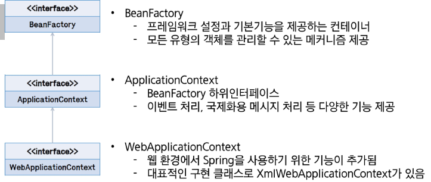
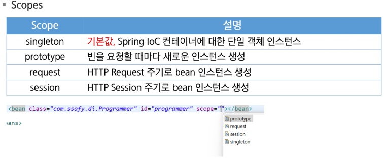

# Spring DI

# Spring Framework

## Framework?
* 사전적 의미 : 뼈대, 틀
* SW에서의 의미: SW 특정 문제를 해결하기 위해서 상호 협력하는 클래스와 인터페이스의 집합

## Framework 왜 사용하는가?
* 웹 어플을 개발하기 위해서는 많은 기본 기능을 설계, 작성해야 한다.
* 공통으로 사용되는 기본기능들을 일관되게 사용할 수 있으면 개발자는 웹 어플리케이션 기능 자체 개발에만 신경을 쓰면 되기 때문에 생산성이 높아진다.
* 개발자 입장에서는 완성된 구조에 맡은 기능을 개발하여 넣어주면 되기 때문에 개발 시간을 단축할 수 있다.

## Spring Framework의 특징
* POJO(Plain Old Java Object) 방식의 프레임워크
* 의존성 주입(Dependency Injection)을 통한 객체관계 구성
* 관점지향 프로그래밍(AOP, Aspect Oriented Programming)
* 제어 역전(IoC, Inversion of Control)
* 높은 확장성과 다양한 라이브러리 

# Spring Container Build

* Spring IoC container
    * Container? 
        * 스프링에서 핵심적인 역할을 하는 객체를 Bean이라고 하며, 
        * Container는 Bean의 인스턴스화 조립, 관리의 역할, 사용 소멸에 대한 처리를 담당한다.

* Bean Scope
    * Bean 정의를 작성하는 것은 Bean 객체를 생성하는 것과는 다르다.
    * Bean 범위(Scope)를 정의해서 객체의 범위를 제어할 수 있다.
    
 

