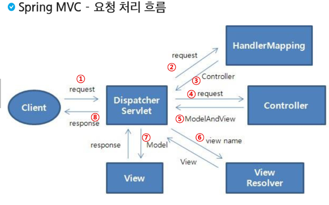
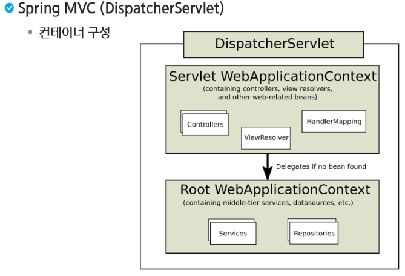

# Spring MVC
## MVC
* 동작을 수행하는 코드
* 사용자 View에 어떻게 보일지에 대해서 신경x
* 데이터 질의에 대한 정보를 제공하는 기능 및 데이터에 대한 수정을 담당

## View
* 사용자가 화면에 무엇을 어떻게 볼 것인지를 결정
* 사용자 화면에 보이는 부분
* 모델의 정보를 받아와 사용자에게 보여주는 역할 수행
* 자체적으로 모델의 정보를 보관 x

## Controller
* 요청을 받아 검증하고 비즈니스 로직을 수행
* 모델과 뷰를 연결하는 역할을 수행
* 사용자에게 데이터를 가져오고 수정하고 제공함

# Spring Web MVC
* Servlet API를 기반으로 구축된 Web Framework
* 정식 명칭은 Spring Web MVC이지만, Spring MVC로 주로 알려져 있음
* Spring Framework이 제공하는 DI, AOP뿐 아니라, Web개발을 위한 기능을 제공

## Spring MVC 구성 요소
* DispatcherServlet -> 클라이언크 요청처리(요청 및 처리 결과 전달)
* HandlerMapping -> 요청을 어떤 Controller가 처리할지 결정
* Controller -> 요청에 따라 수행할 메서드를 선언하고, 요청처리를 위한 로직 수행(비즈니스 로직 호출)
* ModelAndView -> 요청처리를 하기 위해서 필요한 혹은 그 결과를 저장하기 위한 객체
* ViewResolver -> Controller에 선언된 view이름을 기반으로 결과를 반환할 View를 결정
* View -> 응답화면 생성

## Spring MVC - 요청 처리 흐름

## Spring MVC - 요청 처리 흐름
1. 클라이언트 요청이 들어오면 DispatcherServlet이 받는다.
2. HandlerMapping이 어떤 Controller가 요청을 처리할지 결정한다.
3. DispatcerServlet은 Controller에 요청을 전달
4. Controller는 요청을 처리한다.
5. 결과(요청처리를 위한 data, 결과를 보여줄 view의 이름)를 ModelAndView에 담아 반환
6. ViewResolver에 의해서 실제 결과를 처리할 View를 결정하고 반환
7. 결과를 처리할 View에 ModelAndView를 전달
8. DispatcherServlet은 View가 만들어낸 결과를 응답

